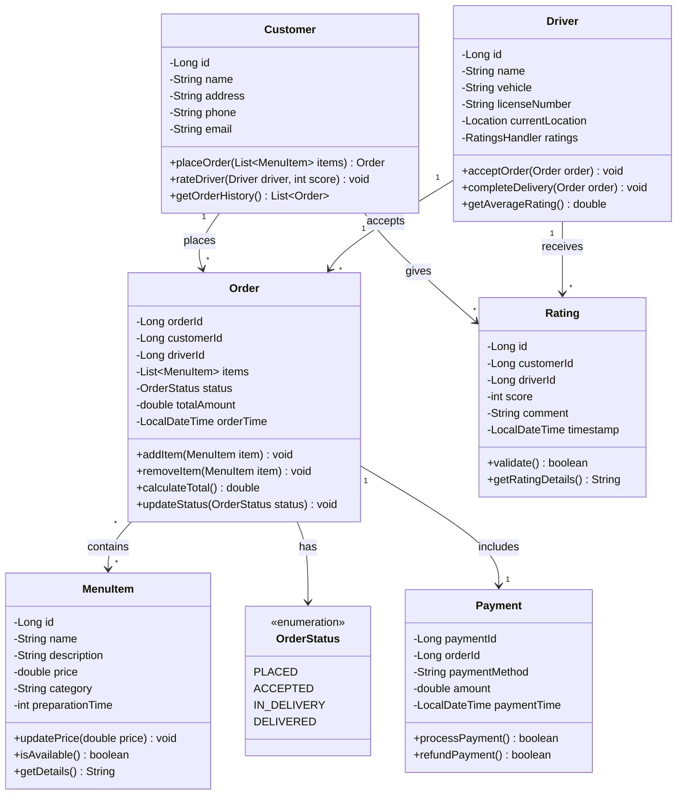

# Online Food Delivery System

A Java-based food delivery system implementing core OOP principles and efficient data structures.

## Core Features

- **Order Management**: Place and track orders for hamburgers, fries, and drinks
- **Delivery Handling**: Driver assignment and delivery status tracking
- **Rating System**: Customer ratings for drivers using circular buffer (max 10 ratings)
- **FIFO Order Processing**: Orders processed in sequence received

## Implementation Details

### Data Structures
- **Circular Buffer**: For driver ratings (fixed size: 10)
  ```java
  class RatingsHandler {
      private List<Rating> ratings; // Max size 10
      public void add(Rating rating) {
          if (ratings.size() >= 10) {
              ratings.remove(0); // Remove oldest
          }
          ratings.add(rating);
      }
  }
  ```

- **Queue**: FIFO order processing
  ```java
  class OrderQueue {
      private Queue<Order> pendingOrders;
      public void addOrder(Order order) {
          pendingOrders.offer(order);
      }
  }
  ```

### OOP Principles
1. **Encapsulation**
   - Private fields with getter/setter methods
   - Internal implementation hidden from external classes

2. **Inheritance**
   ```java
   abstract class MenuItem {
       protected double price;
       public abstract double calculateTotal();
   }
   
   class Hamburger extends MenuItem {
       public double calculateTotal() {
           return price + toppings.stream()
                   .mapToDouble(Topping::getPrice)
                   .sum();
       }
   }
   ```

3. **Polymorphism**
   - Order processing varies by menu item type
   - Rating system implements common interface

4. **Abstraction**
   - Clear interfaces for order and delivery operations
   - Complex operations hidden behind simple methods




## Development Timeline
- **Nov 8**: Initial design submission
- **Nov 14**: Design revision
- **Nov 21**: Core implementation demo
- **Dec 5**: Final system demonstration

## Running the Application

To run the application, follow these steps:

1. **Clone the repository**:
   ```sh
   git clone https://github.com/Surfer12/OnlineFoodDelieveryV.01.git
   cd OnlineFoodDelieveryV.01
   ```

2. **Build the project**:
   ```sh
   ./gradlew build
   ```

3. **Run the application**:
   ```sh
   ./gradlew run
   ```

## Dependencies

The project uses the following dependencies:

- **JUnit Jupiter**: For unit testing
- **Mockito**: For mocking in unit tests
- **Guava**: For additional utilities

## Setup Steps

1. **Ensure you have Java 17 installed**.
2. **Ensure you have Gradle installed**.
3. **Follow the steps in the "Running the Application" section to build and run the project**.

## Usage Examples

### Example 1: Placing an Order
```java
DeliverySystem deliverySystem = new DeliverySystem();
MenuItemFactory factory = new MenuItemFactory();
MenuItem pizza = factory.createMenuItem("hamburger", "Pepperoni Pizza", "Spicy pepperoni with cheese", 12.99, Size.MEDIUM, 1);

Order order = new OrderBuilder()
    .withValidatedCustomerId(1L)
    .withCustomerEmail("jane.doe@example.com")
    .addItem(pizza)
    .withValidatedDeliveryLocation("456 Elm Street", "12345")
    .build();

deliverySystem.submitOrder(order);
```

### Example 2: Assigning a Driver
```java
Driver driver = new Driver(101L, "Bob Smith", "Car", "ABC123");
deliverySystem.registerDriver(driver);
deliverySystem.assignOrderToDriver(order, driver);
```

### Example 3: Completing a Delivery
```java
deliverySystem.completeDelivery(order.getOrderId(), driver.getId());
```

## System Architecture Overview

The Online Food Delivery System is designed with a modular architecture to ensure scalability, maintainability, and ease of testing. The key components of the system are:

1. **DeliverySystem**: Manages the overall order processing, driver assignment, and delivery tracking.
2. **OrderBuilder**: Constructs and validates orders.
3. **OrderQueue**: Manages the queue of pending orders.
4. **NotificationService**: Handles sending notifications to customers and drivers.
5. **InputValidationUtils**: Provides utility methods for input validation.
6. **OrderValidator**: Validates orders before processing.
7. **ConsoleInputHandler**: Handles console input and validation.
8. **InputValidator**: Validates and parses input of a generic type.
9. **Driver**: Represents a delivery driver.
10. **Order**: Represents a customer order.
11. **MenuItem**: Represents a menu item.
12. **Rating**: Represents a customer rating for a driver.

The system follows core OOP principles such as encapsulation, inheritance, polymorphism, and abstraction to ensure a clean and maintainable codebase. The use of design patterns such as the Builder pattern for constructing orders and the Observer pattern for notifying observers of order events further enhances the system's design.

The class diagram provided in the "Implementation Details" section illustrates the relationships between the key classes in the system.

## Frequently Asked Questions (FAQs)

### Q1: What is the purpose of the Online Food Delivery System?
A1: The Online Food Delivery System is designed to manage food orders, assign drivers for delivery, and track the delivery status. It also includes features for customer ratings and order processing.

### Q2: How do I place an order?
A2: You can place an order by creating an instance of the `OrderBuilder` class, adding menu items, and submitting the order to the `DeliverySystem`. Refer to the usage example for placing an order.

### Q3: How are drivers assigned to orders?
A3: Drivers are assigned to orders based on their availability. The `DeliverySystem` automatically assigns a driver to an order when it is submitted.

### Q4: How can I track the status of my order?
A4: The `DeliverySystem` tracks the status of each order and sends notifications to customers about the order status updates.

### Q5: What are the dependencies required to run the application?
A5: The application requires Java 17 and Gradle. Additionally, it uses dependencies such as JUnit Jupiter for unit testing, Mockito for mocking in unit tests, and Guava for additional utilities.
