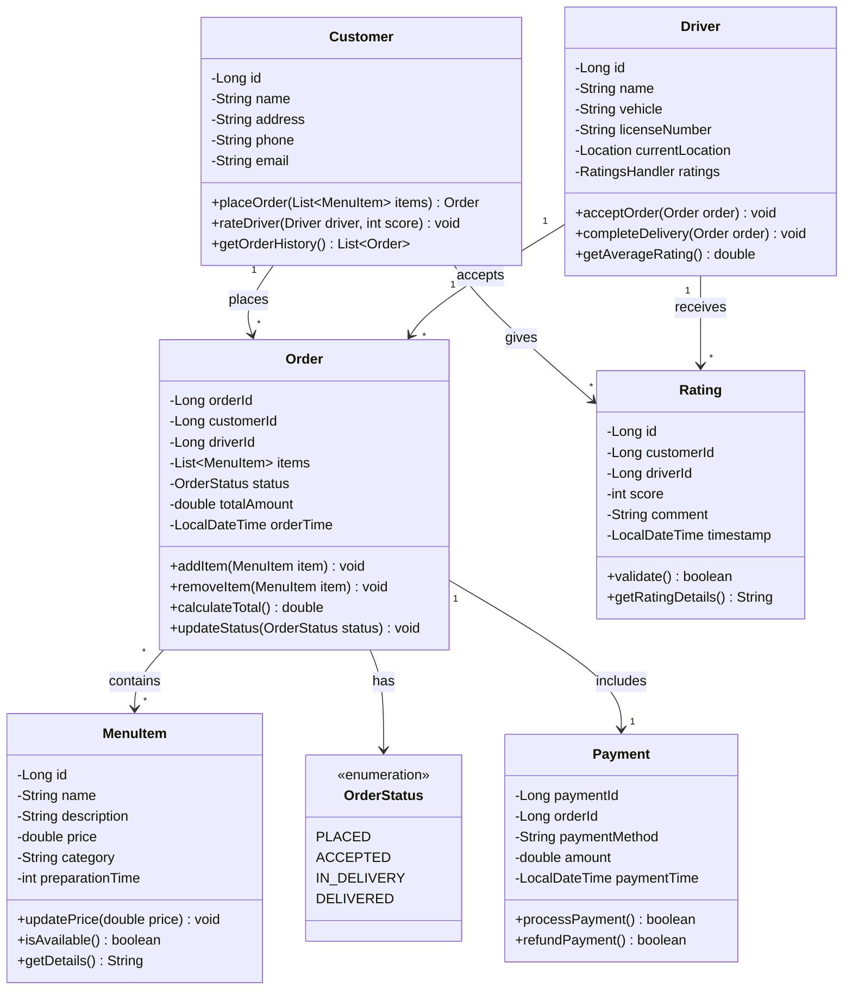

# Online Food Delivery System

A Java-based food delivery system implementing core OOP principles and efficient data structures.

## Core Features

- **Order Management**: Place and track orders for hamburgers, fries, and drinks
- **Delivery Handling**: Driver assignment and delivery status tracking
- **Rating System**: Customer ratings for drivers using circular buffer (max 10 ratings)
- **FIFO Order Processing**: Orders processed in sequence received

## Implementation Details

### Data Structures
- **Circular Buffer**: For driver ratings (fixed size: 10)
  ```java
  class RatingsHandler {
      private List<Rating> ratings; // Max size 10
      public void add(Rating rating) {
          if (ratings.size() >= 10) {
              ratings.remove(0); // Remove oldest
          }
          ratings.add(rating);
      }
  }
  ```

- **Queue**: FIFO order processing
  ```java
  class OrderQueue {
      private Queue<Order> pendingOrders;
      public void addOrder(Order order) {
          pendingOrders.offer(order);
      }
  }
  ```

### OOP Principles
1. **Encapsulation**
   - Private fields with getter/setter methods
   - Internal implementation hidden from external classes

2. **Inheritance**
   ```java
   abstract class MenuItem {
       protected double price;
       public abstract double calculateTotal();
   }
   
   class Hamburger extends MenuItem {
       public double calculateTotal() {
           return price + toppings.stream()
                   .mapToDouble(Topping::getPrice)
                   .sum();
       }
   }
   ```

3. **Polymorphism**
   - Order processing varies by menu item type
   - Rating system implements common interface

4. **Abstraction**
   - Clear interfaces for order and delivery operations
   - Complex operations hidden behind simple methods

### Class Diagram


## Development Timeline
- **Nov 8**: Initial design submission
- **Nov 14**: Design revision
- **Nov 21**: Core implementation demo
- **Dec 5**: Final system demonstration