# Online Food Delivery System Design Documentation

## Class Structure and Relationships

The system is designed with separation of concerns among classes and associated relationships and follows object-oriented principles in a few key areas.

### Core Classes
1. **Customer**: Manages customer information and order placement
2. **Driver**: Handles delivery operations, location tracking, and rating management
3. **Order**: Processes order details and status tracking
4. **MenuItem**: Base abstract class for food items
5. **OrderTracker**: Manages order status updates

## OOP Principles Implementation

### 1. Encapsulation

The codebase demonstrates strong encapsulation through:
- Private fields that are only accessible through public methods

Example from Abstract MenuItem class:
```java
public abstract class MenuItem {
   private Long id;
   private String name;
   private String description;
   private double price;
   private String category;
   private boolean available;

    // Null exception safe access through Optional
    public Optional<String> getDescription() {
        return Optional.ofNullable(description);
    }
}
```
I'll help you describe the data structures used in your food delivery system. Based on the codebase shown, here's a comprehensive breakdown:

### Data Structures Used

1. **ConcurrentHashMap**

1.1 **Why ConcurrentHashMap over HashMap?**

**Thread-safety measures ensure that the food delivery system can handle multiple concurrent users, orders, and drivers without data corruption or race conditions.**

- Multiple threads can access the order system simultaneously
- Better performance in concurrent scenarios
- Built-in thread safety without external synchronization
- Atomic operations for status updates

Used for:
- Order status tracking (`orderStatuses`)
- Estimated delivery times (`estimatedDeliveryTimes`) 
- Active orders (`orders`)

Benefits:
- Thread-safe operations for concurrent order processing
- Better performance than synchronized collections
- Atomic operations support
- No null values allowed, reducing potential errors

2. **ArrayList**
Used for:
- Observer pattern implementation
- Menu item storage in orders

2.1 **Why ArrayList over LinkedList for Order Items?**
- Frequent random access when processing orders
- Less memory overhead
- Better cache locality
- Infrequent insertions/deletions in the middle

Benefits:
- Dynamic sizing for variable number of items
- Fast random access
- Good for sequential access patterns
- Efficient for small to medium collections

3. **Queue Interface**

3.1 **Why Queue for Order Processing?**
- Natural FIFO behavior matches business requirements
- Clear separation of concerns
- Easy to implement priority ordering if needed later
- Efficient enqueue/dequeue operations
Used for:
- FIFO order processing
- Ensuring orders are processed in sequence

Benefits:
- Natural fit for order processing workflow
- Maintains order sequence
- Clear separation of concerns

4. **Fixed-Size List**
Used in the rating system to maintain recent driver ratings:

4.1 **Why Fixed-Size List for Ratings?**
- Constant memory usage
- Only recent ratings are relevant
- Simple implementation
- Efficient access and updates

Benefits:
- Constant memory usage
- Efficient for maintaining recent ratings
- Automatic removal of old ratings


### 2. Abstraction

The system effectively uses both interfaces and abstract classes to hide implementation details and define contracts:

1. **Interfaces**:

NotificationService is an interface that defines the contract for sending notifications to customers and drivers through the OrderObserver interface. This interface abstracts the notification delivery update mechanism.

OrderObserver defines the update 'contract' for order updates as necessary. This interface abstracts the notification update mechanism and is known as the 'Observer' in the Observer pattern.
```java
:src/observer/OrderObserver.java
public interface OrderObserver {
   public void update(Order order);
}
```
Implemented by both CustomerNotifier and DriverNotifier classes.
Example from DriverNotifier:
```java
src/observer/DriverNotifier.java
public class DriverNotifier implements OrderObserver {
   private final NotificationService notificationService;

   public DriverNotifier(NotificationService notificationService) {
      this.notificationService = notificationService;
   }

   @Override
   public void update(Order order) {
      if (order.getDriverId() != null) {
         notificationService.sendOrderStatusUpdateToCustomer(order, order.getStatus());
      }
   }
}
```

d. `NotificationService`: Abstracts notification delivery

```java
src/notification/NotificationService.java
public interface NotificationService {
   void sendOrderConfirmationToCustomer(Order order);

   void sendDriverAssignmentNotification(Order order, Driver driver);

   void sendOrderStatusUpdateToCustomer(Order order, OrderStatus newStatus);

   void sendDeliveryCompletionNotification(Order order);
}
```


2. **Abstract Classes**:

a. `MenuItem`: Base class for all menu items

```java
src/menu/MenuItem.java
public abstract class MenuItem {
   private Long id;
   private String name;
   private String description;
   private double price;
   private String category;
   private boolean available;

   public MenuItem(Long id, String name, String description, double price, String category, int preparationTime) {
      this.id = id;
      this.name = name;
      this.description = description;
      this.price = price;
      this.category = category;
      this.preparationTime = preparationTime;
      this.available = true;
   }

```

Provides common base abstract concept while allowing specific implementations for different food items like hamburgers, fries, and drinks.

3. **Implementation Examples**:

a. CustomerNotifier implementing OrderObserver:

```java
src/observer/CustomerNotifier.java
public class CustomerNotifier implements OrderObserver {
   private final NotificationService notificationService;

   public CustomerNotifier(NotificationService notificationService) {
      this.notificationService = notificationService;
   }

   @Override
   public void update(Order order) {
      notificationService.sendOrderStatusUpdateToCustomer(order, order.getStatus());
   }
}
```


b. OrderTracker implementing OrderSubject:

```java 
14:41:src/order/OrderTracker.java
public class OrderTracker implements OrderSubject {
   private final Map<Long, OrderStatus> orderStatuses;
   private final Map<Long, LocalDateTime> estimatedDeliveryTimes;
   private final List<OrderObserver> observers;
   private final Map<Long, Order> orders = new ConcurrentHashMap<>();

   public OrderTracker() {
      this.orderStatuses = new ConcurrentHashMap<>();
      this.estimatedDeliveryTimes = new ConcurrentHashMap<>();
      this.observers = new ArrayList<>();
   }

   @Override
   public void attach(OrderObserver observer) {
      observers.add(observer);
   }

   @Override
   public void detach(OrderObserver observer) {
      observers.remove(observer);
   }

   @Override
   public void notifyObservers(Order order) {
      for (OrderObserver observer : observers) {
         observer.update(order);
      }
   }
```


### Benefits of this abstraction approach include:
- **Loose Coupling**: Components interact through interfaces rather than concrete implementations
- **Flexibility**: Easy to add new implementations (e.g., new notification types or matching strategies)
- **Maintainability**: Implementation details are hidden behind clean interfaces
- **Testability**: Interfaces make it easy to mock components for testing
- **Extensibility**: New functionality can be added without modifying existing code

This abstraction design allows the system to be easily extended with new features while maintaining a clean and maintainable codebase.

### 3. Inheritance

The system uses inheritance through the MenuItem hierarchy, managed by MenuItemFactory:

Use of switch statement to create different menu items based on the type and the factory pattern to manage the creation of menu items.

```java
public MenuItem createMenuItem(String type, String name, String description, double basePrice) {
    return switch (type.toLowerCase()) {
        case "hamburger" -> new Hamburger(nextId++, name, description, basePrice);
        case "drink" -> new Drink(nextId++, name, description, basePrice, Size.MEDIUM);
        case "fries" -> new Fries(nextId++, name, description, basePrice, Size.MEDIUM);
        default -> throw new IllegalArgumentException("Unknown menu item type: " + type);
    };
}
```

### 4. Polymorphism

Demonstrated through:

1. **Interface Implementation**:
```java
public class CustomerNotifier implements OrderObserver {
    private final NotificationService notificationService;

    @Override
    public void update(Order order) {
        notificationService.sendOrderStatusUpdateToCustomer(order, order.getStatus());
    }
}
```

2. **Method Overriding**: Different implementations for notifications to customers and drivers about associated order updates. 

## Design Patterns

### 1. Builder Pattern 

Used for complex order construction with validation:
1. Step by step construction of the order object
2. Validation of the order object at each step
3. Return of the order object after final validation before creation.

```java
public class OrderBuilder {
    private Long customerId;
    private List<MenuItem> items = new ArrayList<>();
    private Location deliveryLocation;
    private String customerEmail;

    public Order build() {
        validateOrderRequirements();
        return new Order(customerId, items, deliveryLocation, customerEmail);
    }
}
```

Example of basic order:
```java
Order basicOrder = new OrderBuilder()
    .withValidatedCustomerId(123L)
    .addItem(burger)
    .withDeliveryLocation(location)
    .withCustomerEmail("customer@example.com")
    .build();
```

### 2. Observer Pattern

Implemented for order tracking and notifications:

```java
public class OrderTrackingService implements OrderSubject {
    private List<OrderObserver> observers = new ArrayList<>();

    @Override
    public void attach(OrderObserver observer) {
        observers.add(observer);
    }

    @Override
    public void notifyObservers(Order order) {
        for (OrderObserver observer : observers) {
            observer.update(order);
        }
    }
}
```

### 3. Factory Pattern

Used for creating menu items with consistent ID generation:

```java
public class MenuItemFactory {
    private static long nextId = 1;

    public MenuItem createMenuItem(String type, String name, String description, double basePrice) {
        return switch (type.toLowerCase()) {
            case "hamburger" -> new Hamburger(nextId++, name, description, basePrice);
            case "drink" -> new Drink(nextId++, name, description, basePrice, Size.MEDIUM);
            case "fries" -> new Fries(nextId++, name, description, basePrice, Size.MEDIUM);
            default -> throw new IllegalArgumentException("Unknown menu item type: " + type);
        };
    }
}
```

### 4. Strategy Pattern

Used for flexible driver and customer notificaitons. 

The system demonstrates modern Java practices through:
- Use of Optional for null safety
- Strong validation in builders of orders from customers
- Immutable objects where appropriate
- Clear separation of concerns with explicit package structuring and interface as well as abstract class utilization. 


