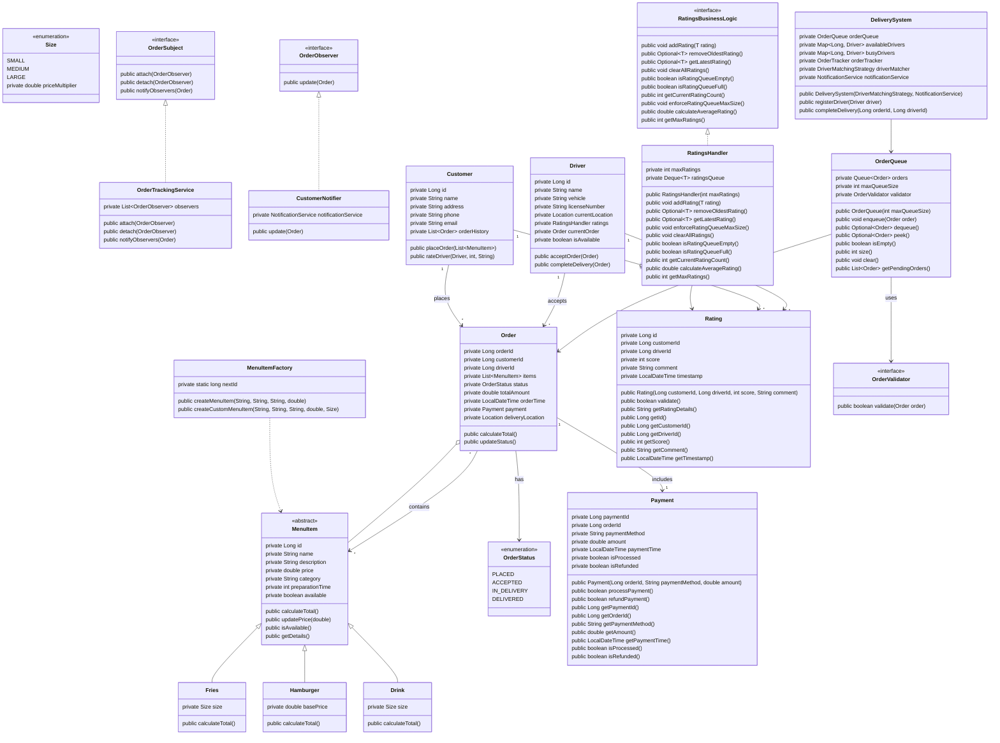

# Online Food Delivery System Design Documentation

## Class Structure and Relationships

The system is designed with separation of concerns among classes and associated relationships and follows object-oriented principles in a few key areas.

### Core Classes
1. **Customer**: Manages customer information and order placement
2. **Driver**: Handles delivery operations, location tracking, and rating management
3. **Order**: Processes order details and status tracking
4. **MenuItem**: Base abstract class for food items
5. **OrderTracker**: Manages order status updates

## OOP Principles Implementation

### 1. Encapsulation

The codebase demonstrates strong encapsulation through:
- Private fields that are only accessible through public methods

Example from Abstract MenuItem class:
```java
public abstract class MenuItem {
   private Long id;
   private String name;
   private String description;
   private double price;
   private String category;
   private boolean available;

    // Null exception safe access through Optional
    public Optional<String> getDescription() {
        return Optional.ofNullable(description);
    }
}
```

### 2. Abstraction

The system effectively uses both interfaces and abstract classes to hide implementation details and define contracts:

1. **Interfaces**:

NotificationService is an interface that defines the contract for sending notifications to customers and drivers through the OrderObserver interface. This interface abstracts the notification delivery update mechanism.

OrderObserver defines the update 'contract' for order updates as necessary. This interface abstracts the notification update mechanism and is known as the 'Observer' in the Observer pattern.
```java
:src/observer/OrderObserver.java
public interface OrderObserver {
   public void update(Order order);
}
```
Implemented by both CustomerNotifier and DriverNotifier classes.
Example from DriverNotifier:
```java
src/observer/DriverNotifier.java
public class DriverNotifier implements OrderObserver {
   private final NotificationService notificationService;

   public DriverNotifier(NotificationService notificationService) {
      this.notificationService = notificationService;
   }

   @Override
   public void update(Order order) {
      if (order.getDriverId() != null) {
         notificationService.sendOrderStatusUpdateToCustomer(order, order.getStatus());
      }
   }
}
```

b. `OrderSubject`: Defines subject behavior for observer pattern
```java:src/observer/OrderSubject.java
public interface OrderSubject {
    void attach(OrderObserver observer);
    void detach(OrderObserver observer);
    void notifyObservers(Order order);
}
```
Implemented by OrderTracker and OrderTrackingService to manage observer notifications.

d. `NotificationService`: Abstracts notification delivery

```java
src/notification/NotificationService.java
public interface NotificationService {
   void sendOrderConfirmationToCustomer(Order order);

   void sendDriverAssignmentNotification(Order order, Driver driver);

   void sendOrderStatusUpdateToCustomer(Order order, OrderStatus newStatus);

   void sendDeliveryCompletionNotification(Order order);
}
```


2. **Abstract Classes**:

a. `MenuItem`: Base class for all menu items

```java
src/menu/MenuItem.java
public abstract class MenuItem {
   private Long id;
   private String name;
   private String description;
   private double price;
   private String category;
   private boolean available;

   public MenuItem(Long id, String name, String description, double price, String category, int preparationTime) {
      this.id = id;
      this.name = name;
      this.description = description;
      this.price = price;
      this.category = category;
      this.preparationTime = preparationTime;
      this.available = true;
   }

```

Provides common base abstract concept while allowing specific implementations for different food items like hamburgers, fries, and drinks.

3. **Implementation Examples**:

a. CustomerNotifier implementing OrderObserver:

```java
src/observer/CustomerNotifier.java
public class CustomerNotifier implements OrderObserver {
   private final NotificationService notificationService;

   public CustomerNotifier(NotificationService notificationService) {
      this.notificationService = notificationService;
   }

   @Override
   public void update(Order order) {
      notificationService.sendOrderStatusUpdateToCustomer(order, order.getStatus());
   }
}
```


b. OrderTracker implementing OrderSubject:

```java 
14:41:src/order/OrderTracker.java
public class OrderTracker implements OrderSubject {
   private final Map<Long, OrderStatus> orderStatuses;
   private final Map<Long, LocalDateTime> estimatedDeliveryTimes;
   private final List<OrderObserver> observers;
   private final Map<Long, Order> orders = new ConcurrentHashMap<>();

   public OrderTracker() {
      this.orderStatuses = new ConcurrentHashMap<>();
      this.estimatedDeliveryTimes = new ConcurrentHashMap<>();
      this.observers = new ArrayList<>();
   }

   @Override
   public void attach(OrderObserver observer) {
      observers.add(observer);
   }

   @Override
   public void detach(OrderObserver observer) {
      observers.remove(observer);
   }

   @Override
   public void notifyObservers(Order order) {
      for (OrderObserver observer : observers) {
         observer.update(order);
      }
   }
```


### Benefits of this abstraction approach include:
- **Loose Coupling**: Components interact through interfaces rather than concrete implementations
- **Flexibility**: Easy to add new implementations (e.g., new notification types or matching strategies)
- **Maintainability**: Implementation details are hidden behind clean interfaces
- **Testability**: Interfaces make it easy to mock components for testing
- **Extensibility**: New functionality can be added without modifying existing code

This abstraction design allows the system to be easily extended with new features while maintaining a clean and maintainable codebase.

### 3. Inheritance

The system uses inheritance through the MenuItem hierarchy, managed by MenuItemFactory:

Use of switch statement to create different menu items based on the type and the factory pattern to manage the creation of menu items.

```java
public MenuItem createMenuItem(String type, String name, String description, double basePrice) {
    return switch (type.toLowerCase()) {
        case "hamburger" -> new Hamburger(nextId++, name, description, basePrice);
        case "drink" -> new Drink(nextId++, name, description, basePrice, Size.MEDIUM);
        case "fries" -> new Fries(nextId++, name, description, basePrice, Size.MEDIUM);
        default -> throw new IllegalArgumentException("Unknown menu item type: " + type);
    };
}
```

### 4. Polymorphism

Demonstrated through:

1. **Interface Implementation**:
```java
public class CustomerNotifier implements OrderObserver {
    private final NotificationService notificationService;

    @Override
    public void update(Order order) {
        notificationService.sendOrderStatusUpdateToCustomer(order, order.getStatus());
    }
}
```

2. **Method Overriding**: Different implementations for notifications to customers and drivers about associated order updates. 

## Design Patterns

### 1. Builder Pattern

Used for complex order construction with validation:

```java
public class OrderBuilder {
    private Long customerId;
    private List<MenuItem> items = new ArrayList<>();
    private Location deliveryLocation;
    private String customerEmail;

    public OrderBuilder withValidatedCustomerId(Long customerId) {
        if (customerId == null || customerId <= 0) {
            throw new IllegalArgumentException("Invalid customer ID");
        }
        this.customerId = customerId;
        return this;
    }

    public Order build() {
        validateOrderRequirements();
        return new Order(customerId, items, deliveryLocation, customerEmail);
    }
}
```

### 2. Observer Pattern

Implemented for order tracking and notifications:

```java
public class OrderTrackingService implements OrderSubject {
    private List<OrderObserver> observers = new ArrayList<>();

    @Override
    public void attach(OrderObserver observer) {
        observers.add(observer);
    }

    @Override
    public void notifyObservers(Order order) {
        for (OrderObserver observer : observers) {
            observer.update(order);
        }
    }
}
```

### 3. Factory Pattern

Used for creating menu items with consistent ID generation:

```java
public class MenuItemFactory {
    private static long nextId = 1;

    public MenuItem createMenuItem(String type, String name, String description, double basePrice) {
        return switch (type.toLowerCase()) {
            case "hamburger" -> new Hamburger(nextId++, name, description, basePrice);
            case "drink" -> new Drink(nextId++, name, description, basePrice, Size.MEDIUM);
            case "fries" -> new Fries(nextId++, name, description, basePrice, Size.MEDIUM);
            default -> throw new IllegalArgumentException("Unknown menu item type: " + type);
        };
    }
}
```

### 4. Strategy Pattern

Used for flexible driver matching algorithms:

```java
public interface DriverMatchingStrategy {
    Optional<Driver> findBestMatch(Order order, List<Driver> availableDrivers);
}

// Implementation in ProximityBasedMatchingStrategy
public Optional<Driver> findBestMatch(Order order, List<Driver> availableDrivers) {
    // Implementation specific to proximity-based matching
}
```

The system demonstrates modern Java practices through:
- Use of Optional for null safety
- Strong validation in builders
- Immutable objects where appropriate
- Thread-safe collections (ConcurrentHashMap)
- Clear separation of concerns

## Class Diagram

Additional Notes: 

### Observer pattern:

The Observer pattern is used to notify customers and drivers about order updates. The OrderSubject interface defines the subject behavior, and the OrderObserver interface defines the update contract for order updates. The CustomerNotifier and DriverNotifier classes implement the OrderObserver interface and provide specific implementations of the update method.

### Observer Pattern Explanation

The Observer pattern is a behavioral design pattern that establishes a one-to-many relationship between objects. When one object (the Subject/Observable) changes state, all its dependents (Observers) are notified and updated automatically.

## Structure in Your System

### 1. Core Components

**Subject Interface (`OrderSubject`)**
```java:src/observer/OrderSubject.java
public interface OrderSubject {
    void attach(OrderObserver observer);    // Add an observer
    void detach(OrderObserver observer);    // Remove an observer
    void notifyObservers(Order order);      // Notify all observers
}
```

**Observer Interface (`OrderObserver`)**
```java:src/observer/OrderObserver.java
public interface OrderObserver {
    void update(Order order);    // Method called when subject changes
}
```

### 2. Implementation Examples

**Concrete Subject (`OrderTracker`)**
```java:src/order/OrderTracker.java
public class OrderTracker implements OrderSubject {
    private final List<OrderObserver> observers = new ArrayList<>();

    @Override
    public void attach(OrderObserver observer) {
        observers.add(observer);
    }

    @Override
    public void detach(OrderObserver observer) {
        observers.remove(observer);
    }

    @Override
    public void notifyObservers(Order order) {
        for (OrderObserver observer : observers) {
            observer.update(order);
        }
    }
}
```

**Concrete Observers**
```java:src/observer/CustomerNotifier.java
public class CustomerNotifier implements OrderObserver {
    private final NotificationService notificationService;

    @Override
    public void update(Order order) {
        notificationService.sendOrderStatusUpdateToCustomer(order, order.getStatus());
    }
}
```

## Benefits in System

1. **Decoupled Communication**: The order tracking system doesn't need to know about specific notification implementations.
2. **Easy Extension**: You can add new types of notifications (SMS, Email, Push) without modifying existing code.
3. **Real-time Updates**: All interested parties get immediate updates when order status changes.

## Usage Example

```java
// Create the subject
OrderTracker orderTracker = new OrderTracker();

// Create observers
CustomerNotifier customerNotifier = new CustomerNotifier(notificationService);
DriverNotifier driverNotifier = new DriverNotifier(notificationService);

// Register observers
orderTracker.attach(customerNotifier);
orderTracker.attach(driverNotifier);

// When order status changes
Order order = new Order(/*...*/);
order.setStatus(OrderStatus.IN_DELIVERY);
orderTracker.notifyObservers(order);  // All observers will be notified
```

## Common Use Cases in Your System

1. Order status updates
2. Driver location changes
3. Payment status notifications
4. Delivery time updates

This pattern is particularly useful in your food delivery system because it allows for a flexible notification system where different components can subscribe to order updates without creating tight coupling between the order processing and notification logic."

## The Strategy pattern 

allows you to define a family of algorithms, encapsulate each one, and make them interchangeable. In your system, it's used to handle different types of notifications.


"I'll explain how the Strategy pattern is used in the NotificationService implementation.

# Strategy Pattern in NotificationService

The Strategy pattern allows you to define a family of algorithms, encapsulate each one, and make them interchangeable. In your system, it's used to handle different types of notifications.

## Core Structure

### 1. Strategy Interface
````java:src/notification/NotificationService.java
public interface NotificationService {
    void sendOrderConfirmationToCustomer(Order order);
    void sendDriverAssignmentNotification(Order order, Driver driver);
    void sendOrderStatusUpdateToCustomer(Order order, OrderStatus newStatus);
    void sendDeliveryCompletionNotification(Order order);
}
````

### 2. Concrete Strategy Examples
````java:src/notification/EmailNotificationService.java
public class EmailNotificationService implements NotificationService {
    private final EmailClient emailClient;

    @Override
    public void sendOrderConfirmationToCustomer(Order order) {
        String email = order.getCustomerEmail();
        String message = createOrderConfirmationMessage(order);
        emailClient.sendEmail(email, "Order Confirmation", message);
    }

    // Other method implementations...
}
````

````java:src/notification/SMSNotificationService.java
public class SMSNotificationService implements NotificationService {
    private final SMSGateway smsGateway;

    @Override
    public void sendOrderConfirmationToCustomer(Order order) {
        String phone = order.getCustomerPhone();
        String message = createOrderConfirmationMessage(order);
        smsGateway.sendSMS(phone, message);
    }

    // Other method implementations...
}
````

### 3. Usage Example
````java:src/notification/NotificationManager.java
public class NotificationManager {
    private final NotificationService notificationService;

    // Inject the specific notification strategy
    public NotificationManager(NotificationService notificationService) {
        this.notificationService = notificationService;
    }

    public void handleOrderConfirmation(Order order) {
        notificationService.sendOrderConfirmationToCustomer(order);
    }
}

// Usage
NotificationService emailService = new EmailNotificationService();
NotificationService smsService = new SMSNotificationService();

// Use email notifications
NotificationManager emailManager = new NotificationManager(emailService);

// Use SMS notifications
NotificationManager smsManager = new NotificationManager(smsService);
````

## Benefits

1. **Flexibility**: Easy to add new notification types (e.g., push notifications, WhatsApp)
2. **Single Responsibility**: Each notification service handles one type of notification
3. **Runtime Switching**: Can change notification strategy based on user preferences
4. **Testing**: Easy to mock for testing purposes
5. **Configuration**: Can be configured via dependency injection

## Common Use Cases

1. **User Preferences**
````java
public class UserPreferenceBasedNotificationService implements NotificationService {
    private final Map<NotificationType, NotificationService> services;
    
    public void sendOrderConfirmationToCustomer(Order order) {
        NotificationType preferredType = order.getCustomer().getPreferredNotificationType();
        NotificationService service = services.get(preferredType);
        service.sendOrderConfirmationToCustomer(order);
    }
}
````

2. **Fallback Mechanism**
````java
public class FallbackNotificationService implements NotificationService {
    private final List<NotificationService> services;
    
    public void sendOrderConfirmationToCustomer(Order order) {
        for (NotificationService service : services) {
            try {
                service.sendOrderConfirmationToCustomer(order);
                return; // Success
            } catch (NotificationException e) {
                // Log and try next service
                continue;
            }
        }
        throw new NotificationFailedException("All notification attempts failed");
    }
}
````

3. **Multi-Channel Notifications**
````java
public class MultiChannelNotificationService implements NotificationService {
    private final List<NotificationService> services;
    
    public void sendOrderConfirmationToCustomer(Order order) {
        CompletableFuture<?>[] futures = services.stream()
            .map(service -> CompletableFuture.runAsync(() -> 
                service.sendOrderConfirmationToCustomer(order)))
            .toArray(CompletableFuture[]::new);
        
        CompletableFuture.allOf(futures).join();
    }
}
````

This pattern makes your notification system highly flexible and maintainable, allowing for easy addition of new notification methods without changing the existing code."


