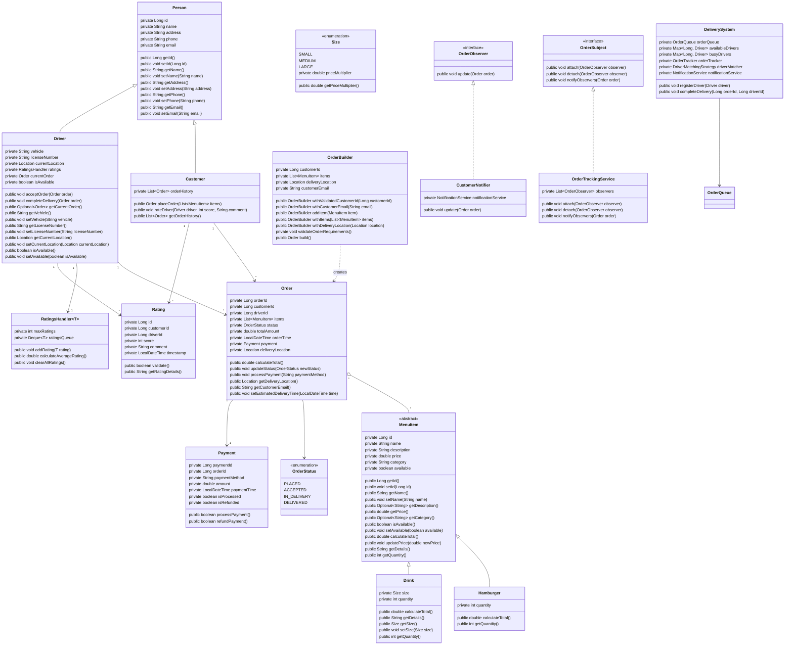

# Task Distribution

Overall will be divided into a single task that each individual will complete.

Ensure that each OOP Principle is implemented in the code and apparent throughout the project.

OOP Principles:

- Polymorphism:
- Abstraction:
- Inheritance:
- Encapsulation:

The project tasks will be divided into four main areas of focus, each with specific OOP principle responsibilities and design pattern implementations:

# 1. **Order Processing and Workflow** 
## Ryan Oates
   - **Focus Areas:**
     - Polymorphism in Order and MenuItem classes
     - Observer Pattern implementation
     - Order lifecycle management
   - **Key Responsibilities:**
     - Implement Order class with polymorphic behavior
     - Develop OrderTracker and notification mechanisms
     - Manage OrderStatus transitions
     - Implement OrderObserver and OrderSubject interfaces
   - **OOP Principles of focus area:**
     - Inheritance in Person, Customer, and Driver classes
     - Abstraction: Hide complex order processing details
     - Encapsulation: Protect order state and transitions
   - **Potential Team Member Task:** Implement polymorphic order processing and validation and notification system for customer and driver

# 2. **User and Interaction Management** 
## Gigi 
   - **Focus Areas:**
     - Builder Pattern for user and order creation
     - Rating and feedback system
   - **Key Responsibilities:**
     - Develop Person base class
     - Implement Customer and Driver inheritance
     - Create OrderBuilder with strong validation
     - Manage RatingsHandler and rating mechanisms
   - **OOP Principles:**
     - Inheritance: Extending base Person class
     - Encapsulation: Protecting user data
     - Abstraction: Providing clean interfaces for user interactions
   - **Potential Team Member Task:** Design and implement user-related classes with robust builder patterns and inheritance structures.

# 3. **Menu and Item Management Team**
## Selena 
   - **Focus Areas:**
     - Polymorphism: Order item processing and validation for various menu item types notifying driver and customer of status of availability, location, successful delivery.
     - Abstract and concrete menu item implementations
     - Factory methods for menu item creation
     - Price calculation and item management
   - **Key Responsibilities:**
     - Implement MenuItem abstract class
     - Create concrete classes like Hamburger, Drink
     - Develop menu item factory
     - Implement availability logic
   - **OOP Principles:**
     - Abstraction: Abstract menu item base class
     - Polymorphism: Different methods for menu item type utilities 
     - Encapsulation: Protecting menu item properties
   - **Potential Team Member Task:** Create a flexible and extensible menu item system with polymorphic behavior.

# 4. **System Infrastructure and System Performance**
## Nick 
   - **Focus Areas:**
     - Order queue management
   - **Key Responsibilities:**
     - Implement notification system 
     - Develop ratings queue collections
     - Manage order queue and ratings operations 
   - **OOP Principles:**
     - Dependency Inversion: Using interfaces for rating and notifications for abstract 
     - Interface-based design
     - Encapsulation of operations
   - **Potential Team Member Task:** Design the system's core infrastructure with a focus on modular design and error avoidance through input validation and effective design. 

## Learning Objectives for Each: 

- **Order Processing:** 
  - Event-driven programming
  - Observer pattern understanding 
  - State management 

- **User and Interaction:** 
  - Object-oriented design pattern usage with 
  - Builder pattern
  - Inheritance hierarchies

- **Menu and Item:**
  - Abstract class design
  - Polymorphic validation 
  - Factory method design pattern 

- **System Infrastructure and System Design Team:**
  - Design patterns
  - System architecture

