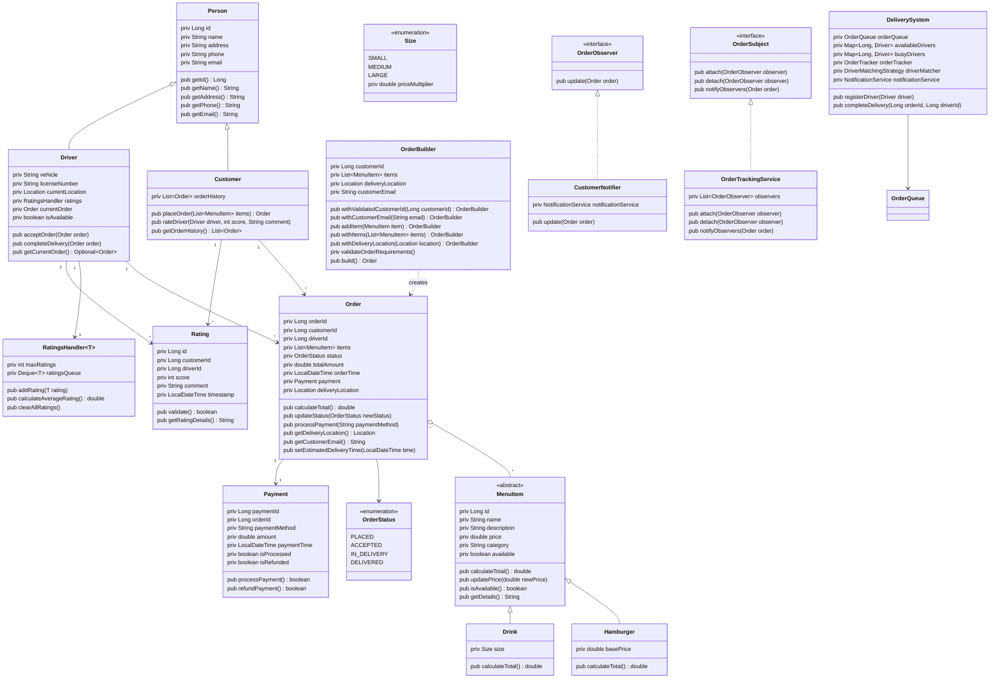

Updated flowchart 

Task Distribution: Overall will be divided into a single task that each individual will complete.

Ensure that each OOP Principle is implemented in the code and apparent throughout the project.

Polymorphism : 
Abstraction : 
Inheritance : 
Encapsulation : 

